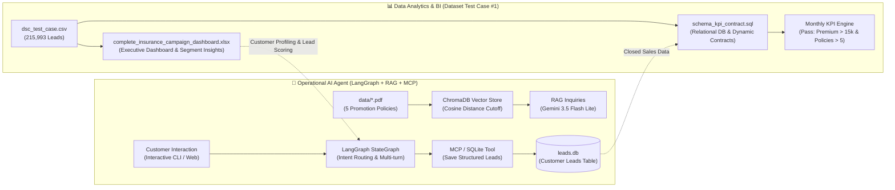
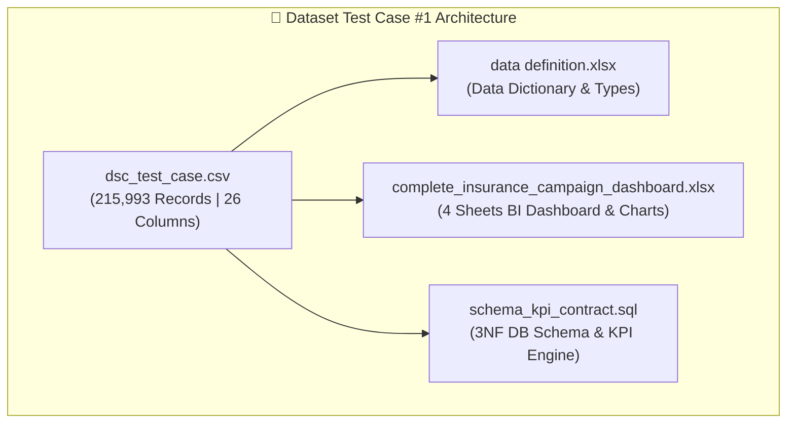
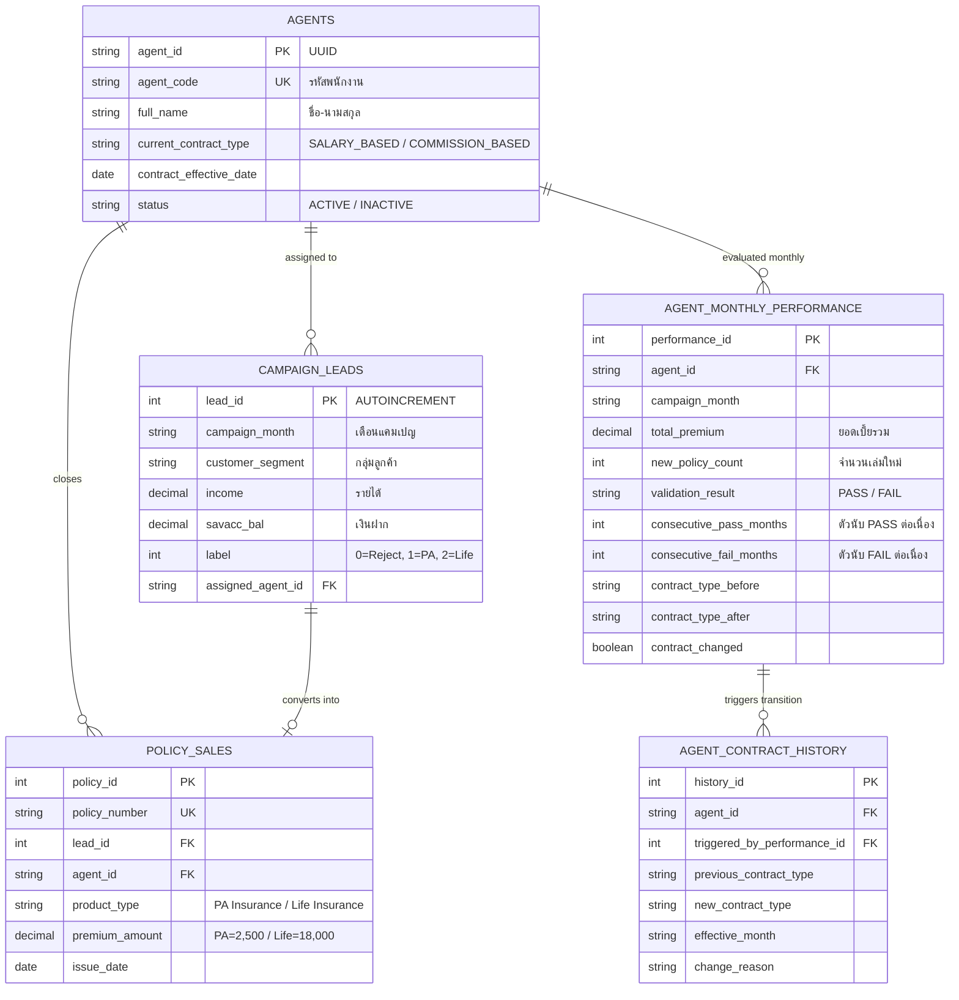
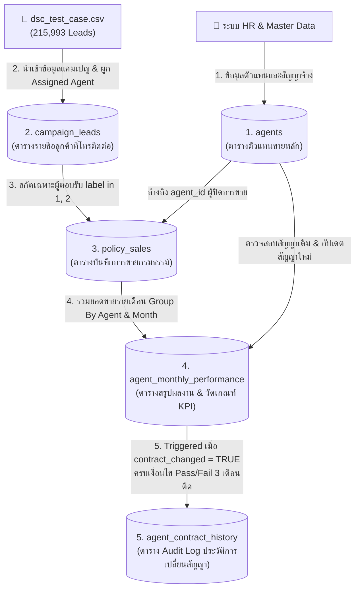
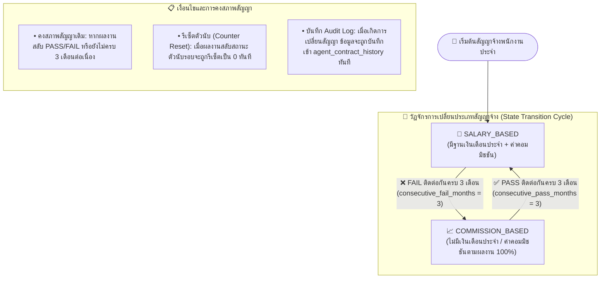
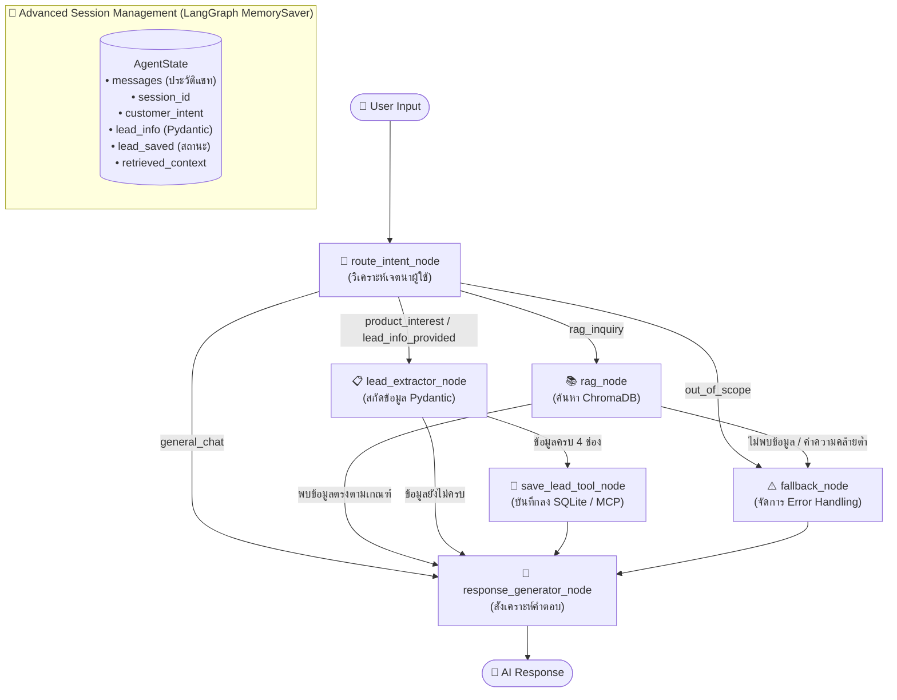

# 🛡️ InsureX Unified Sales & Analytics Ecosystem

ระบบบูรณาการอัจฉริยะสำหรับธุรกิจประกันภัย **InsureX** ครอบคลุมทั้ง **(1) การวิเคราะห์แคมเปญและระบบบริหารผลงานตัวแทนขาย (Performance & KPI Management)** ตามชุดข้อมูลในโฟลเดอร์ `Dataset Test Case #1` และ **(2) ระบบ AI Sales Agent อัจฉริยะ** (พัฒนาด้วย LangChain, LangGraph, ChromaDB, Pydantic, SQLite, และ Model Context Protocol - MCP)

---

## 📑 สารบัญ (Table of Contents)

1. [🌟 ภาพรวมระบบแบบบูรณาการ (Ecosystem Overview)](#-ภาพรวมระบบแบบบูรณาการ-ecosystem-overview)
2. [🗂️ โครงสร้างโปรเจกต์ (Project Structure)](#️-โครงสร้างโปรเจกต์-project-structure)
3. [📊 ส่วนที่ 1: การวิเคราะห์แคมเปญและระบบบริหารสัญญาตัวแทน (Dataset Test Case #1)](#-ส่วนที่-1-การวิเคราะห์แคมเปญและระบบบริหารสัญญาตัวแทน-dataset-test-case-1)
   - [ภาพรวมชุดข้อมูล (dsc_test_case.csv & Data Definition)](#ภาพรวมชุดข้อมูล-dsc_test_casecsv--data-definition)
   - [แดชบอร์ดสรุปผลผู้บริหาร (complete_insurance_campaign_dashboard.xlsx)](#แดชบอร์ดสรุปผลผู้บริหาร-complete_insurance_campaign_dashboardxlsx)
   - [สกีมาฐานข้อมูลและระบบประเมิน KPI (schema_kpi_contract.sql)](#สกีมาฐานข้อมูลและระบบประเมิน-kpi-schema_kpi_contractsql)
     - [ที่มาและเหตุผลในการออกแบบแต่ละตาราง (Table Lineage & Design Rationale)](#1-ที่มาและเหตุผลในการออกแบบแต่ละตาราง-table-lineage--design-rationale)
     - [กฎการประเมิน KPI รายเดือน (Monthly Validation Rules)](#2-กฎการประเมิน-kpi-รายเดือน-monthly-validation-rules)
     - [กลไกการปรับเปลี่ยนประเภทสัญญาจ้างอัตโนมัติ (Automated State Transitions)](#3-กลไกการปรับเปลี่ยนประเภทสัญญาจ้างอัตโนมัติ-automated-state-transitions)
   - [ขั้นตอนการประมวลผลข้อมูล (ETL & Evaluation Pipeline)](#ขั้นตอนการประมวลผลข้อมูล-etl--evaluation-pipeline)
4. [🤖 ส่วนที่ 2: InsureX AI Sales Agent & Intelligent Assistant](#-ส่วนที่-2-insurex-ai-sales-agent--intelligent-assistant)
   - [จุดเด่นของระบบ AI Agent (Key Highlights)](#จุดเด่นของระบบ-ai-agent-key-highlights)
   - [สถาปัตยกรรมระบบ (LangGraph Workflow & State Machine)](#สถาปัตยกรรมระบบ-langgraph-workflow--state-machine)
   - [ขั้นตอนการติดตั้งและเริ่มต้นใช้งาน (Quickstart Guide)](#ขั้นตอนการติดตั้งและเริ่มต้นใช้งาน-quickstart-guide)
   - [วิธีการรันโปรแกรม (How to Run)](#วิธีการรันโปรแกรม-how-to-run)
   - [คู่มือการใช้งาน Tool และ MCP Server (Tooling Guide)](#คู่มือการใช้งาน-tool-และ-mcp-server-tooling-guide)
   - [ตัวอย่างผลการทดสอบจริง (Execution Demo Logs)](#ตัวอย่างผลการทดสอบจริง-execution-demo-logs)
5. [🚀 ส่วนที่ 3: การเชื่อมโยงข้อมูลสู่กลยุทธ์ธุรกิจ (Strategic Synergy)](#-ส่วนที่-3-การเชื่อมโยงข้อมูลสู่กลยุทธ์ธุรกิจ-strategic-synergy)
6. [🏆 สรุปผลตามเกณฑ์การประเมิน (Evaluation Matrix)](#-สรุปผลตามเกณฑ์การประเมิน-evaluation-matrix)

---

## 🌟 ภาพรวมระบบแบบบูรณาการ (Ecosystem Overview)

โปรเจกต์ InsureX ได้รับการออกแบบให้เชื่อมโยงระหว่าง **การวิเคราะห์ข้อมูลหลังบ้าน (Data Analytics & BI Engine)** และ **การปฏิบัติการขายหน้าร้าน (AI Operational Sales)** อย่างไร้รอยต่อ:


```mermaid
flowchart LR
    subgraph Analytics ["📊 Data Analytics & BI (Dataset Test Case #1)"]
        RawData["dsc_test_case.csv\n(215,993 Leads)"] --> BI["complete_insurance_campaign_dashboard.xlsx\n(Executive Dashboard & Segment Insights)"]
        RawData --> SQL["schema_kpi_contract.sql\n(Relational DB & Dynamic Contracts)"]
        SQL --> KPI["Monthly KPI Engine\n(Pass: Premium > 15k & Policies > 5)"]
    end

    subgraph AgentSystem ["🤖 Operational AI Agent (LangGraph + RAG + MCP)"]
        PDFs["data/*.pdf\n(5 Promotion Policies)"] --> Chroma["ChromaDB Vector Store\n(Cosine Distance Cutoff)"]
        Chroma --> RAG["RAG Inquiries\n(Gemini 3.5 Flash Lite)"]
        Chat["Customer Interaction\n(Interactive CLI / Web)"] --> Workflow["LangGraph StateGraph\n(Intent Routing & Multi-turn)"]
        Workflow --> MCPTool["MCP / SQLite Tool\n(Save Structured Leads)"]
        MCPTool --> SQLiteDB[("leads.db\n(Customer Leads Table)")]
    end

    BI -. Customer Profiling & Lead Scoring .-> Workflow
    SQLiteDB -. Closed Sales Data .-> SQL
```

---

## 🗂️ โครงสร้างโปรเจกต์ (Project Structure)

```text
insureX test/
├── Dataset Test Case #1/                             # ฐานข้อมูลแคมเปญ แดชบอร์ด และสกีมาประเมินผลตัวแทน
│   ├── dsc_test_case.csv                             # ข้อมูลประวัติการโทรเสนอขายแคมเปญ 215,993 รายการ (26 ฟิลด์)
│   ├── data definition.xlsx                          # พจนานุกรมข้อมูล (Data Dictionary) อธิบายทุกคอลัมน์
│   ├── complete_insurance_campaign_dashboard.xlsx    # Executive BI Dashboard 4 ชีต พร้อมกราฟและผลวิเคราะห์
│   └── schema_kpi_contract.sql                       # สกีมาฐานข้อมูลและระบบปรับเปลี่ยนประเภทสัญญาจ้างตาม KPI
├── data/                                             # โฟลเดอร์เก็บเอกสาร PDF ฐานความรู้ (ครบทั้ง 5 ฉบับ)
│   ├── โปรโมชั่น _ ซื้อความคุ้มครอง ประกันภัย อุ่นใจ ประจำไตรมาส 3 อินชัวร์ เอกซ์ ( InsureX ).pdf
│   ├── โปรโมชั่น _ วางแผนวันนี้ อุ่นใจทุกก้าวชัวร์ สมัครประกันชีวิตของ FWD รับสิทธิพิเศษ อินชัวร์ เอกซ์ ( InsureX ).pdf
│   ├── โปรโมชั่น _ InsureX Free PA สำหรับลูกค้า FPC Worksite & Non CB อินชัวร์ เอกซ์ ( InsureX ).pdf
│   ├── โปรโมชั่น _ สิทธิพิเศษ สำหรับครูและบุคลากรทางการศึกษาในสังกัดกระทรวงศึกษาธิการ อินชัวร์ เอกซ์ ( InsureX ).pdf
│   └── โปรโมชั่น _ สิทธิพิเศษ สำหรับบุคลากรสาธารณสุขและอาสาสมัครสาธารณสุขประจำหมู่บ้าน (อสม.) ในสังกัดกระทรวงสาธารณสุข อินชัวร์ เอกซ์ ( InsureX ).pdf
├── chroma_db/                                        # โฟลเดอร์ฐานข้อมูล Vector Store (ChromaDB)
├── leads.db                                          # ฐานข้อมูล SQLite สำหรับบันทึกข้อมูลลูกค้าที่สนใจ (Leads)
├── config.py                                         # การตั้งค่าระบบ และการโหลด Environment Variables
├── agent_state.py                                    # โครงสร้าง State ของ LangGraph (AgentState TypedDict)
├── lead_models.py                                    # Pydantic Model สำหรับตรวจสอบและจัดการ Lead (`CustomerLead`)
├── lead_db.py                                        # โมดูลจัดการฐานข้อมูล SQLite (CRUD Leads)
├── mcp_server.py                                     # MCP Server (Model Context Protocol 2.x) และ LangChain Tool
├── rag_service.py                                    # บริการโหลด PDF, Semantic Chunking, และ Vector Search
├── prompts.py                                        # System Prompts สำหรับ Agent แต่ละสถานะ (น้องอินชัวร์)
├── agent_workflow.py                                 # การประกอบ LangGraph Workflow และ Memory Checkpointer
├── main.py                                           # โปรแกรมสนทนา Interactive CLI (Rich UI)
├── demo_test.py                                      # ชุดทดสอบอัตโนมัติครอบคลุม 4 Test Cases หลัก
├── requirements.txt                                  # รายการ Library dependencies
└── README.md                                         # เอกสารสรุปโปรเจกต์ฉบับสมบูรณ์
```

---

## 📊 ส่วนที่ 1: การวิเคราะห์แคมเปญและระบบบริหารสัญญาตัวแทน (Dataset Test Case #1)

โฟลเดอร์ `Dataset Test Case #1` คือชุดข้อมูลและโมเดลการประเมินผลการดำเนินงานจริงของแคมเปญประกันภัย เชื่อมโยงระเบียบวิธีทางสถิติเข้ากับระบบบริหารบุคลากรขายของ InsureX


```mermaid
flowchart TD
    subgraph DataFolder ["📂 Dataset Test Case #1 Architecture"]
        CSV["dsc_test_case.csv\n(215,993 Records | 26 Columns)"]
        Def["data definition.xlsx\n(Data Dictionary & Types)"]
        Excel["complete_insurance_campaign_dashboard.xlsx\n(4 Sheets BI Dashboard & Charts)"]
        SQL["schema_kpi_contract.sql\n(3NF DB Schema & KPI Engine)"]
    end

    CSV --> Def
    CSV --> Excel
    CSV --> SQL
```

---

### ภาพรวมชุดข้อมูล (dsc_test_case.csv & Data Definition)

ชุดข้อมูล `dsc_test_case.csv` ประกอบด้วยประวัติการโทรเสนอขายประกันจำนวน **215,993 แถว** มีตัวแปรสำคัญรวม 26 ตัวแปร (อ้างอิงตาม `data definition.xlsx`) ดังนี้:

| กลุ่มตัวแปร | ฟิลด์สำคัญ | ประเภทข้อมูล | คำอธิบายและความหมายทางธุรกิจ |
| :--- | :--- | :---: | :--- |
| **Campaign Timing** | `campaign_month` | `string` | เดือนที่ติดต่อเสนอขายลูกค้า (เช่น Jan, Feb, Mar ... Dec) |
| **Demographics** | `customer_segment`<br>`marital_sta`<br>`gender`<br>`age`<br>`num_children` | `string`<br>`string`<br>`string`<br>`double`<br>`integer` | - ระดับกลุ่มลูกค้า: **Lower Mass**, **Mass**, **Upper Mass**<br>- สถานะสมรส, เพศ, อายุ, และจำนวนบุตร |
| **Financial Behaviors** | `income`<br>`savacc_bal`<br>`currentacc_bal`<br>`easypymt_last_30d` | `decimal(12,2)` | - รายได้เฉลี่ยต่อเดือนของลูกค้า<br>- ยอดเงินฝากออมทรัพย์ และกระแสรายวัน<br>- ยอดการชำระเงินผ่านระบบ Easy Payment ในรอบ 30 วัน |
| **Cashflow & Cards** | `inflow30d`<br>`outflow30d`<br>`net_flow_30d`<br>`have_cc`<br>`scb_payroll`<br>`have_acc_planet` | `decimal(12,2)`<br>`decimal(13,2)`<br>`string (Y/N)` | - กระแสเงินสดไหลเข้า/ออก และยอดสุทธิรอบ 30 วัน<br>- บัญชีเงินเดือน SCB Payroll<br>- การถือบัตรเครดิต และบัตรเดินทาง Planet Card |
| **Tenure (MOB)** | `mob` | `integer` | Month on Book (ระยะเวลาการเป็นลูกค้าหน่วยเป็นเดือน) |
| **Target Label** | `label` | `integer` | **ผลลัพธ์การติดต่อ (Campaign Response)**:<br>• `0` = ปฏิเสธข้อเสนอ (Reject Offer)<br>• `1` = ตกลงทำประกันอุบัติเหตุส่วนบุคคล (PA Insurance)<br>• `2` = ตกลงทำประกันชีวิต (Life Insurance) |

#### สถิติการตอบรับ (Outcome Distribution):
* **`label = 0` (Reject / No response)**: 213,371 ราย (**98.79%**)
* **`label = 1` (Accepted PA Insurance)**: 1,634 ราย (**0.76%**)
* **`label = 2` (Accepted Life Insurance)**: 988 ราย (**0.46%**)
* **รวมลูกค้าที่ตอบรับ (Accepted Total)**: **2,622 ราย**
* **อัตราตอบรับรวม (Overall Acceptance Rate)**: **1.21%**
* **สัดส่วนประกันชีวิต (Life Insurance Share)**: **37.68%** (จากผู้ซื้อทั้งหมด)

---

### แดชบอร์ดสรุปผลผู้บริหาร (complete_insurance_campaign_dashboard.xlsx)

ไฟล์แดชบอร์ด Excel ถูกออกแบบตามมาตรฐาน Business Intelligence เพื่อให้ผู้บริหารเห็นภาพรวมและเข้าใจพฤติกรรมลูกค้าเชิงลึก ประกอบด้วย 4 ชีต:

```text
complete_insurance_campaign_dashboard.xlsx
├── 1. Dashboard         # แดชบอร์ดผู้บริหาร (KPI Cards, Response Mix, Key Findings, Charts)
├── 2. Analysis          # ตารางวิเคราะห์เจาะลึก 4 มิติ (Segment, Payroll, CC, Travel Card)
├── 3. Data dictionary   # คำอธิบายตัวแปร แหล่งที่มา และ Data Types
└── 4. Data              # ตารางข้อมูลดิบขนาดเต็ม 215,994 บรรทัด
```

#### 1. ชีต `Dashboard` (Executive KPI Summary)
```text
+--------------------------------------------------------------------------------------------------+
|                              Insurance Campaign Response Dashboard                              |
|                    Customer campaign data | Response outcomes | 215,993 records                 |
+---------------------+---------------------+----------------------+-------------------------------+
|  Total Customers    |   Accepted Offers   |  Overall Acceptance  |     Life Insurance Share      |
|      215,993        |        2,622        |        1.21%         |            37.68%             |
+---------------------+---------------------+----------------------+-------------------------------+
| [Response Mix]                             | [Key Findings / Executive Insights]                 |
| • No response:  213,371 (98.79%)           | 1. Upper Mass มีอัตราทำประกันชีวิตสูงที่สุด (0.7%) |
| • PA insurance:   1,634 (0.76%)            | 2. ลูกค้า Payroll ทำ PA สูงที่สุด (0.9%)             |
| • Life insurance:   988 (0.46%)            | 3. ผู้ซื้อประกันชีวิตมี Median รายได้และเงินฝากสูงกว่า |
+--------------------------------------------+-----------------------------------------------------+
| [Chart 1: Bar Chart - Offer Outcome]       | [Chart 2: Line Chart - Monthly Acceptance Rate]     |
| เปรียบเทียบ No response vs PA vs Life       | แสดงแนวโน้ม เม.ย. - ธ.ค. พุ่งสูงสุด ส.ค. (1.95%)      |
+--------------------------------------------+-----------------------------------------------------+
```

- **สูตรคำนวณในแดชบอร์ด**:
  - `Total Customers`: `=COUNT(Data!A2:A215994)` -> `215,993`
  - `Accepted Offers`: `=COUNTIF(Data!Z2:Z215994, ">0")` -> `2,622`
  - `Overall Acceptance`: `=F6 / B6` -> `1.21%`
  - `Life Insurance Share`: `=COUNTIF(Data!Z2:Z215994, 2) / F6` -> `37.68%`

#### 2. ชีต `Analysis` (Deep-Dive Policy & Payment Analysis)

จากการคำนวณอัตราการตอบรับในแต่ละกลุ่มประชากร:

##### ก) วิเคราะห์ตามกลุ่มลูกค้า (`customer_segment`):
| Customer Segment | No Response | PA Insurance | Life Insurance | รวมการตอบรับ (All) | ข้อมูลเชิงลึก (Key Insight) |
| :--- | :---: | :---: | :---: | :---: | :--- |
| **Lower Mass** | 98.74% | **0.89%** | 0.38% | **1.26%** | เน้นทำประกันอุบัติเหตุ PA สูงสุด |
| **Mass** | 98.82% | 0.65% | 0.53% | 1.18% | มีความต้องการทั้ง 2 ผลิตภัณฑ์ใกล้เคียงกัน |
| **Upper Mass** | 98.79% | 0.53% | **0.68%** | **1.21%** | **อัตราการทำประกันชีวิตสูงสุดในทุกกลุ่ม** |
| *Missing* | 99.93% | 0.07% | 0.00% | 0.07% | ข้อมูลไม่สมบูรณ์ แทบไม่มีการตอบรับ |

##### ข) วิเคราะห์ตามพฤติกรรมทางการเงินและบัญชี:
- **บัญชีเงินเดือน (`scb_payroll`)**:
  - ลูกค้าที่มีบัญชีเงินเดือน (`Y`): มีอัตราตอบรับรวม **1.40%** (PA: 0.85%, Life: 0.54%) สูงกว่ากลุ่มที่ไม่มีบัญชีเงินเดือน (`N`: 1.18%) อย่างชัดเจน
- **การถือบัตรเครดิต (`have_cc`)**:
  - ลูกค้าที่ **ไม่มีบัตรเครดิต (`N`)**: นิยมทำประกันอุบัติเหตุ PA มากกว่า (0.81% vs 0.32%)
  - ลูกค้าที่ **มีบัตรเครดิต (`Y`)**: นิยมทำประกันชีวิต Life มากกว่า (0.65% vs 0.44%)
- **ค่ามัธยฐานทางการเงิน (Median Financial Profiles)**:
  - ผู้ซื้อประกันชีวิต (`label=2`): รายได้เฉลี่ย **15,140 บาท/เดือน**, เงินฝากออมทรัพย์ **1,436 บาท** (สูงกว่ากลุ่มปฏิเสธที่มีเงินฝากเพียง 800 บาทอย่างมีนัยสำคัญ)

##### ค) แนวโน้มฤดูกาลรายเดือน (Monthly Seasonality):
- อัตราตอบรับขยับตัวสูงขึ้นตั้งแต่เดือนมิถุนายนถึงกันยายน โดยแตะระดับสูงสุดใน **เดือนสิงหาคม (1.95%)** และ **กรกฎาคม (1.90%)** เมื่อเทียบกับไตรมาสแรกและไตรมาสสี่ที่เฉลี่ยอยู่ที่ 0.80% - 1.14%

---

### สกีมาฐานข้อมูลและระบบประเมิน KPI (schema_kpi_contract.sql)

ไฟล์ `schema_kpi_contract.sql` ออกแบบสถาปัตยกรรมฐานข้อมูลเชิงสัมพันธ์ (3NF Relational Database) เพื่อรองรับการนำรายชื่อ Lead จากแคมเปญมาจ่ายงานให้ตัวแทนขาย พร้อมทั้งคำนวณผลงานรายเดือนและปรับประเภทสัญญาจ้างโดยอัตโนมัติ


```mermaid
erDiagram
    AGENTS ||--o{ CAMPAIGN_LEADS : "assigned to"
    AGENTS ||--o{ POLICY_SALES : "closes"
    CAMPAIGN_LEADS ||--o| POLICY_SALES : "converts into"
    AGENTS ||--o{ AGENT_MONTHLY_PERFORMANCE : "evaluated monthly"
    AGENT_MONTHLY_PERFORMANCE ||--o{ AGENT_CONTRACT_HISTORY : "triggers transition"

    AGENTS {
        string agent_id PK "UUID"
        string agent_code UK "รหัสพนักงาน"
        string full_name "ชื่อ-นามสกุล"
        string current_contract_type "SALARY_BASED / COMMISSION_BASED"
        date contract_effective_date
        string status "ACTIVE / INACTIVE"
    }

    CAMPAIGN_LEADS {
        int lead_id PK "AUTOINCREMENT"
        string campaign_month "เดือนแคมเปญ"
        string customer_segment "กลุ่มลูกค้า"
        decimal income "รายได้"
        decimal savacc_bal "เงินฝาก"
        int label "0=Reject, 1=PA, 2=Life"
        string assigned_agent_id FK
    }

    POLICY_SALES {
        int policy_id PK
        string policy_number UK
        int lead_id FK
        string agent_id FK
        string product_type "PA Insurance / Life Insurance"
        decimal premium_amount "PA=2,500 / Life=18,000"
        date issue_date
    }

    AGENT_MONTHLY_PERFORMANCE {
        int performance_id PK
        string agent_id FK
        string campaign_month
        decimal total_premium "ยอดเบี้ยรวม"
        int new_policy_count "จำนวนเล่มใหม่"
        string validation_result "PASS / FAIL"
        int consecutive_pass_months "ตัวนับ PASS ต่อเนื่อง"
        int consecutive_fail_months "ตัวนับ FAIL ต่อเนื่อง"
        string contract_type_before
        string contract_type_after
        boolean contract_changed
    }

    AGENT_CONTRACT_HISTORY {
        int history_id PK
        string agent_id FK
        int triggered_by_performance_id FK
        string previous_contract_type
        string new_contract_type
        string effective_month
        string change_reason
    }
```

#### 1. ที่มาและเหตุผลในการออกแบบแต่ละตาราง (Table Lineage & Design Rationale)

โครงสร้างฐานข้อมูลทั้ง 5 ตารางถูกออกแบบตามหลักการ **3NF (Third Normal Form)** เพื่อแยกหน้าที่ (Separation of Concerns) อย่างชัดเจนระหว่างข้อมูลตัวแทนขาย, รายชื่อลูกค้าจากแคมเปญ, ธุรกรรมการเงิน, และประวัติการประเมินผลงาน:


```mermaid
flowchart TD
    HR["🏢 ระบบ HR & Master Data"] -->|1. ข้อมูลตัวแทนและสัญญาจ้าง| T1[("1. agents\n(ตารางตัวแทนขายหลัก)")]
    
    CSV["📂 dsc_test_case.csv\n(215,993 Leads)"] -->|2. นำเข้าข้อมูลแคมเปญ & ผูก Assigned Agent| T2[("2. campaign_leads\n(ตารางรายชื่อลูกค้าที่โทรติดต่อ)")]
    
    T2 -->|3. สกัดเฉพาะผู้ตอบรับ label in 1, 2| T3[("3. policy_sales\n(ตารางบันทึกการขายกรมธรรม์)")]
    T1 -->|อ้างอิง agent_id ผู้ปิดการขาย| T3
    
    T3 -->|4. รวมยอดขายรายเดือน Group By Agent & Month| T4[("4. agent_monthly_performance\n(ตารางสรุปผลงาน & วัดเกณฑ์ KPI)")]
    T1 -->|ตรวจสอบสัญญาเดิม & อัปเดตสัญญาใหม่| T4
    
    T4 -->|5. Triggered เมื่อ contract_changed = TRUE\nครบเงื่อนไข Pass/Fail 3 เดือนติด| T5[("5. agent_contract_history\n(ตาราง Audit Log ประวัติการเปลี่ยนสัญญา)")]
```

| ลำดับ | ตาราง (Table) | แหล่งที่มาของข้อมูล (Data Origin) | หน้าที่และข้อมูลหลักที่จัดเก็บ | เหตุผลและความจำเป็นในการออกแบบ (Design Rationale) |
| :---: | :--- | :--- | :--- | :--- |
| **1** | **`agents`** | **ระบบบริหารงานบุคคล (HR Master Data)** | เก็บข้อมูลตัวตนตัวแทนขาย (`agent_id`, `agent_code`, `full_name`) สถานะสัญญาจ้างปัจจุบัน (`SALARY_BASED` / `COMMISSION_BASED`) และวันเริ่มสัญญา | เป็น **Master Table (1-to-Many)** ที่เป็นจุดศูนย์กลางในการกระจายงานลูกค้า และเป็น Entity อ้างอิงสำหรับประเมินผลงานของพนักงานขายแต่ละคน |
| **2** | **`campaign_leads`** | **ไฟล์ `dsc_test_case.csv` (215,993 แถว)** | เก็บประวัติและพฤติกรรมลูกค้าจากแคมเปญ (`income`, `savacc_bal`, `customer_segment`, ผลการโทร `label`) เพิ่มฟิลด์ `lead_id` และ `assigned_agent_id` | แปลงข้อมูลดิบ Flat File (CSV) ให้เป็น **Staging Relational Table** เพื่อจำลองการจ่ายรายชื่อ (Lead Distribution) ให้ตัวแทนขายโทรติดต่อเสนอขายจริง |
| **3** | **`policy_sales`** | **สร้างอัตโนมัติจาก `campaign_leads` ที่ `label IN (1, 2)`** | บันทึกธุรกรรมการขายที่สำเร็จ (`policy_number`, `product_type`, `premium_amount`, `issue_date`) เชื่อมโยงกับ `lead_id` และ `agent_id` | แยก **ข้อมูลการตลาด (Leads)** ออกจาก **ธุรกรรมทางการเงิน (Financial Transaction)** ตามหลัก 3NF เพื่อเป็น Single Source of Truth สำหรับคำนวณเบี้ยประกัน |
| **4** | **`agent_monthly_performance`** | **คำนวณ Rollup จาก `policy_sales` รายเดือน** | เก็บผลรวมยอดขาย (`total_premium`, `new_policy_count`) ผลการวัดเกณฑ์ (`validation_result`), ตัวนับสะสม (`consecutive_pass/fail`), และสถานะสัญญา | ทำหน้าที่เป็น **Fact / Snapshot Table** ประจำเดือน ทำให้ระบบตรวจสอบผลงานย้อนหลังได้ทันที โดยไม่ต้องคำนวณ Aggregation ใหม่จากข้อมูลดิบทุกครั้ง |
| **5** | **`agent_contract_history`** | **สร้างอัตโนมัติผ่าน Trigger จาก `agent_monthly_performance`** | เก็บรหัสตัวแทน, สัญญาเดิม, สัญญาใหม่, เดือนที่มีผล, และสาเหตุการปรับเปลี่ยน (`change_reason`) | ทำหน้าที่เป็น **Immutable Audit Log** ตามหลักธรรมาภิบาลข้อมูล (Data Governance) และกฎหมายแรงงาน เพื่อเก็บหลักฐานการปรับลด/เลื่อนสัญญาอย่างโปร่งใส |

---

##### 🔍 รายละเอียดและกระบวนการเกิดของแต่ละตาราง:

1. **ตาราง `agents` (ข้อมูลตัวแทนขายและสัญญาปัจจุบัน)**:
   - **ที่มา**: เริ่มต้นจากระบบ HR Master Data ของบริษัท ซึ่งบันทึกพนักงานขายทุกคน
   - **ความสัมพันธ์**: เชื่อมโยงแบบ One-to-Many กับ `campaign_leads` (เพื่อมอบหมายงาน), `policy_sales` (เพื่อบันทึกยอดขาย), และ `agent_monthly_performance` (เพื่อบันทึกประวัติการประเมิน)
   - **กลไกการอัปเดต**: ฟิลด์ `current_contract_type` และ `contract_effective_date` จะถูกอัปเดตอัตโนมัติเมื่อระบบประเมิน KPI พบเงื่อนไขการเปลี่ยนสัญญา

2. **ตาราง `campaign_leads` (รายชื่อลูกค้าแคมเปญ)**:
   - **ที่มา**: แปลงและนำเข้าข้อมูลดิบ 215,993 แถวจาก `dsc_test_case.csv` เข้าสู่ฐานข้อมูล
   - **การเพิ่มมิติทางธุรกิจ**: ในไฟล์ CSV มีเฉพาะข้อมูลลูกค้า แต่ยังไม่มีการมอบหมายงาน ระบบจึงเพิ่มฟิลด์ `lead_id` (Primary Key Auto-increment) และ `assigned_agent_id` (Foreign Key เชื่อมกับ `agents`) เพื่อจำลองการจ่ายรายชื่อให้ตัวแทนโทรติดต่อจริง

3. **ตาราง `policy_sales` (บันทึกการขายกรมธรรม์ที่ปิดสำเร็จ)**:
   - **ที่มา**: ดึงเฉพาะรายการที่ลูกค้าตอบตกลงทำประกันจาก `campaign_leads` (เงื่อนไข: `label IN (1, 2)`)
   - **Business Rules ในการแปลงค่า**:
     - `label = 1` -> กำหนด `product_type = 'PA Insurance'` และตั้งค่าเบี้ยประกันภัยเฉลี่ย `premium_amount = 2,500.00 บาท`
     - `label = 2` -> กำหนด `product_type = 'Life Insurance'` และตั้งค่าเบี้ยประกันภัยเฉลี่ย `premium_amount = 18,000.00 บาท`
     - ออกรหัสกรมธรรม์ไม่ซ้ำ เช่น `POL-YYYYMM-LEADID`

4. **ตาราง `agent_monthly_performance` (สรุปผลงานและการประเมิน KPI รายเดือน)**:
   - **ที่มา**: รัน Batch สรุปยอดขายจากตาราง `policy_sales` ในแต่ละเดือนและจัดกลุ่มรายตัวแทน (`GROUP BY agent_id, campaign_month`)
   - **ฟังก์ชันการคำนวณและ State Tracking**:
     - `total_premium` = `SUM(premium_amount)` (ผลรวมเบี้ยประกันภัยทั้งหมดในเดือนนั้น)
     - `new_policy_count` = `COUNT(policy_id)` (จำนวนกรมธรรม์ทั้งหมดที่ปิดการขายได้ในเดือนนั้น)
     - ตรวจสอบกฎเกณฑ์: `total_premium > 15,000` และ `new_policy_count > 5`
     - จัดการตัวนับต่อเนื่อง (Consecutive Counters): หากรอบนี้ Pass จะบวก `consecutive_pass_months` เพิ่ม 1 และรีเซ็ต `consecutive_fail_months` เป็น 0 (และในทางกลับกัน)
     - ตัดสินใจปรับสถานะสัญญา: หากสะสม Fail ครบ 3 เดือนจะเปลี่ยนสถานะเป็น `COMMISSION_BASED` และหากสะสม Pass ครบ 3 เดือนจะเปลี่ยนเป็น `SALARY_BASED`

5. **ตาราง `agent_contract_history` (ประวัติการปรับเปลี่ยนประเภทสัญญา - Audit Log)**:
   - **ที่มา**: บันทึกอัตโนมัติเฉพาะเมื่อมีเหตุการณ์เปลี่ยนประเภทสัญญาเกิดขึ้นในตาราง `agent_monthly_performance` (`contract_changed = TRUE`)
   - **จุดประสงค์ทางกฎหมายและการบริหาร**: เป็นตารางประวัติศาสตร์ที่ไม่สามารถแก้ไขย้อนหลังได้ (Append-Only) เพื่อใช้เป็นหลักฐานในการตรวจสอบ (Audit Trail) ในการจ่ายผลตอบแทน คอมมิชชัน และการบริหารสัญญาจ้างตามกฎระเบียบบริษัท

---

#### 2. กฎการประเมิน KPI รายเดือน (Monthly Validation Rules)
ในแต่ละรอบเดือน ตัวแทนขายจะต้องผ่านเกณฑ์ 2 ข้อพร้อมกัน (AND Logic):
1. **ยอดเบี้ยประกันภัยรวม (Total Premium)**: ต้องมากกว่า **15,000.00 บาท**
   ```sql
   is_premium_passed = (total_premium > 15000.00)
   ```
2. **จำนวนกรมธรรม์ฉบับใหม่ (New Policy Count)**: ต้องมากกว่า **5 เล่ม/เดือน**
   ```sql
   is_policy_passed = (new_policy_count > 5)
   ```
3. **ผลการประเมินรายเดือน**:
   ```sql
   validation_result = CASE 
       WHEN total_premium > 15000.00 AND new_policy_count > 5 THEN 'PASS'
       ELSE 'FAIL'
   END
   ```

#### 3. กลไกการปรับเปลี่ยนประเภทสัญญาจ้างอัตโนมัติ (Automated State Transitions)
ประเภทสัญญาจ้างแบ่งเป็น:
- `SALARY_BASED`: มีเงินเดือนประจำ + ค่าคอมมิชชัน
- `COMMISSION_BASED`: ไม่มีเงินเดือนประจำ รับค่าตอบแทนตามผลงาน 100%


```mermaid
flowchart TD
    Start([🚀 เริ่มต้นสัญญาจ้างพนักงานประจำ]) --> StateSalary

    subgraph Contracts ["🔄 วัฏจักรการเปลี่ยนประเภทสัญญาจ้าง (State Transition Cycle)"]
        direction TB
        StateSalary["💼 SALARY_BASED\n(มีฐานเงินเดือนประจำ + ค่าคอมมิชชัน)"]
        StateComm["📈 COMMISSION_BASED\n(ไม่มีเงินเดือนประจำ / ค่าคอมมิชชันตามผลงาน 100%)"]

        StateSalary -->|"❌ FAIL ติดต่อกันครบ 3 เดือน\n(consecutive_fail_months = 3)"| StateComm
        StateComm -->|"✅ PASS ติดต่อกันครบ 3 เดือน\n(consecutive_pass_months = 3)"| StateSalary
    end

    subgraph TransitionRules ["📋 เงื่อนไขและการคงสภาพสัญญา"]
        direction TB
        Rule1["• คงสภาพสัญญาเดิม: หากผลงานสลับ PASS/FAIL หรือยังไม่ครบ 3 เดือนต่อเนื่อง"]
        Rule2["• รีเซ็ตตัวนับ (Counter Reset): เมื่อผลงานสลับสถานะ ตัวนับรอบจะถูกรีเซ็ตเป็น 0 ทันที"]
        Rule3["• บันทึก Audit Log: เมื่อเกิดการเปลี่ยนสัญญา ข้อมูลจะถูกบันทึกเข้า agent_contract_history ทันที"]
    end
```

- **กฎการลดระดับ (Demotion)**:
  - หากสัญญาเดิมคือ `SALARY_BASED` และผลงาน **FAIL ต่อเนื่องครบ 3 เดือน** (`consecutive_fail_months = 3`) -> ปรับสถานะเป็น `COMMISSION_BASED`
- **กฎการเลื่อนระดับ (Promotion)**:
  - หากสัญญาเดิมคือ `COMMISSION_BASED` และผลงาน **PASS ต่อเนื่องครบ 3 เดือน** (`consecutive_pass_months = 3`) -> ปรับสถานะเป็น `SALARY_BASED`
- **การรีเซ็ตตัวนับ (Counter Reset)**:
  - เมื่อผลงานสลับสถานะ (เช่น Fail มา 2 เดือน แต่เดือนที่ 3 ได้ Pass) ตัวนับ Fail จะถูกรีเซ็ตเป็น 0 ทันที เพื่อความเป็นธรรม

---

### ขั้นตอนการประมวลผลข้อมูล (ETL & Evaluation Pipeline)

#### ขั้นที่ 1: การนำเข้าข้อมูล Leads เข้าตาราง `campaign_leads`
```sql
INSERT INTO campaign_leads (
    campaign_month, customer_segment, marital_sta, main_occupation,
    gender, age, income, savacc_bal, net_flow_30d, label, assigned_agent_id
)
SELECT 
    campaign_month, customer_segment, marital_sta, main_occupation,
    gender, age, income, savacc_bal, net_flow_30d, label,
    'AGENT_UUID_001' AS assigned_agent_id
FROM raw_campaign_leads_staging;
```

#### ขั้นที่ 2: บันทึกการขายกรมธรรม์ที่ปิดสำเร็จ (`policy_sales`)
```sql
INSERT INTO policy_sales (
    policy_number, lead_id, agent_id, campaign_month, issue_date, product_type, premium_amount
)
SELECT 
    'POL-' || strftime('%Y%m', 'now') || '-' || lead_id AS policy_number,
    lead_id,
    assigned_agent_id AS agent_id,
    campaign_month,
    DATE('now') AS issue_date,
    CASE 
        WHEN label = 1 THEN 'PA Insurance'
        WHEN label = 2 THEN 'Life Insurance'
    END AS product_type,
    CASE 
        WHEN label = 1 THEN 2500.00   -- ค่าเบี้ยเฉลี่ยประกันอุบัติเหตุ PA
        WHEN label = 2 THEN 18000.00  -- ค่าเบี้ยเฉลี่ยประกันชีวิต Life
    END AS premium_amount
FROM campaign_leads
WHERE label IN (1, 2) AND assigned_agent_id IS NOT NULL;
```

#### ขั้นที่ 3: รันคำนวณและประเมินผล KPI ประจำเดือน (`agent_monthly_performance`)
```sql
WITH MonthlyAgg AS (
    SELECT 
        agent_id,
        campaign_month,
        COALESCE(SUM(premium_amount), 0.00) AS total_premium,
        COUNT(policy_id) AS new_policy_count
    FROM policy_sales
    GROUP BY agent_id, campaign_month
)
SELECT 
    m.agent_id,
    m.campaign_month,
    m.total_premium,
    m.new_policy_count,
    (m.total_premium > 15000.00) AS is_premium_passed,
    (m.new_policy_count > 5) AS is_policy_passed,
    CASE 
        WHEN m.total_premium > 15000.00 AND m.new_policy_count > 5 THEN 'PASS'
        ELSE 'FAIL'
    END AS validation_result
FROM MonthlyAgg m;
```

---

## 🤖 ส่วนที่ 2: InsureX AI Sales Agent & Intelligent Assistant

### จุดเด่นของระบบ AI Agent (Key Highlights)

1. **RAG Knowledge Base ที่แม่นยำสูง (ChromaDB + Gemini Embeddings)**:
   - สกัดและตัดแบ่งเนื้อหา (Semantic Chunking) จากเอกสารโปรโมชั่นและกรมธรรม์ประกันภัยของ InsureX (PDF 5 ฉบับ) พร้อมเก็บ Metadata อ้างอิงแหล่งที่มาและเลขหน้า
   - กำหนดค่า Threshold ระยะห่าง (Distance Cutoff) เพื่อป้องกันอาการคิดไปเอง (Hallucination)
   - **Error Handling อัตโนมัติ**: หากคำถามอยู่นอกเหนือฐานความรู้ ระบบจะแจ้งลูกค้าอย่างสุภาพ ไม่แต่งเติมข้อมูล พร้อมแนะนำช่องทางติดต่อ Call Center 1314 หรือผลิตภัณฑ์ที่เกี่ยวข้องทันที

2. **Bonus Task 1: Structured Lead Collection (MCP / Tooling)**:
   - **Mode Trigger**: ตรวจจับความสนใจของลูกค้า (เช่น *"สนใจสมัคร"*, *"ขอคำปรึกษา"*, *"ติดต่อกลับ"*) เพื่อเปลี่ยนโหมดเข้าสู่กระบวนการเก็บข้อมูลลูกค้า
   - **Data Extraction**: สกัดข้อมูลจำเป็น 4 รายการ ได้แก่ **ชื่อ-นามสกุล, อาชีพ, รายได้ต่อเดือน, และเบอร์โทรศัพท์ติดต่อ**
   - **Validation**: ตรวจสอบความถูกต้องด้วย **Pydantic Model** (`CustomerLead`) รวมถึงตรวจสอบรูปแบบเบอร์โทรศัพท์ไทย 10 หลัก
   - **MCP Protocol & SQLite**: รองรับการเรียกใช้เครื่องมือตามมาตรฐาน **Model Context Protocol (MCP)** และบันทึกข้อมูลลูกค้าลงฐานข้อมูล **SQLite (`leads.db`)** โดยอัตโนมัติเมื่อข้อมูลครบถ้วน

3. **Bonus Task 2: Advanced Session Management**:
   - ควบคุม Context และ Memory แยกตามแต่ละผู้ใช้งานอย่างอิสระด้วย **LangGraph State Checkpointer** (`thread_id`)
   - ป้องกันปัญหาข้อมูลลูกค้ารั่วไหลข้าม Session (Zero Context Bleed)
   - สามารถสนทนาแบบต่อเนื่องหลายรอบ (Multi-turn Conversation) โดยระบบสามารถรวมข้อมูล (Merge partial lead) ที่ลูกค้าค่อยๆ ทยอยแจ้งเข้ามาในแต่ละรอบได้อย่างแม่นยำ

---

### สถาปัตยกรรมระบบ (LangGraph Workflow & State Machine)

ระบบควบคุมการทำงานด้วย **LangGraph StateGraph** ดังแผนภาพ:


```mermaid
flowchart TD
    START([🚀 User Input]) --> RouteIntent["🧭 route_intent_node\n(วิเคราะห์เจตนาผู้ใช้)"]

    %% Branching from Intent Router
    RouteIntent -->|rag_inquiry| RAGNode["📚 rag_node\n(ค้นหา ChromaDB)"]
    RouteIntent -->|product_interest / lead_info_provided| LeadExtractor["📋 lead_extractor_node\n(สกัดข้อมูล Pydantic)"]
    RouteIntent -->|general_chat| ResponseGen["💬 response_generator_node\n(สังเคราะห์คำตอบ)"]
    RouteIntent -->|out_of_scope| FallbackNode["⚠️ fallback_node\n(จัดการ Error Handling)"]

    %% Branching from RAG Node
    RAGNode -->|พบข้อมูลตรงตามเกณฑ์| ResponseGen
    RAGNode -->|ไม่พบข้อมูล / ค่าความคล้ายต่ำ| FallbackNode

    %% Branching from Lead Extractor Node
    LeadExtractor -->|ข้อมูลครบ 4 ช่อง| SaveLeadTool["💾 save_lead_tool_node\n(บันทึกลง SQLite / MCP)"]
    LeadExtractor -->|ข้อมูลยังไม่ครบ| ResponseGen

    %% Convergence
    SaveLeadTool --> ResponseGen
    FallbackNode --> ResponseGen
    ResponseGen --> END([🏁 AI Response])

    %% Subgraph for State Checkpointer
    subgraph SessionMemory ["🧠 Advanced Session Management (LangGraph MemorySaver)"]
        State[("AgentState\n• messages (ประวัติแชท)\n• session_id\n• customer_intent\n• lead_info (Pydantic)\n• lead_saved (สถานะ)\n• retrieved_context")]
    end
```

#### รายละเอียด Nodes ใน LangGraph:
- **`route_intent_node`**: ใช้ LLM ร่วมกับ Context ประวัติและสถานะปัจจุบันในการจำแนก Intent (`rag_inquiry`, `product_interest`, `lead_info_provided`, `general_chat`, `out_of_scope`)
- **`rag_node`**: ค้นหาข้อความที่เกี่ยวข้องใน ChromaDB ด้วย Cosine Distance หากค่าเกินเกณฑ์จะส่งต่อไปยัง `fallback_node`
- **`lead_extractor_node`**: สกัดข้อมูลลูกค้าด้วย Structured Output เข้า Pydantic Model พร้อมฟังก์ชัน `merge_with()` เพื่อรวมข้อมูลเก่าและใหม่ในบทสนทนาหลายรอบ
- **`save_lead_tool_node`**: ตรวจสอบความครบถ้วนของข้อมูล (ชื่อ, อาชีพ, รายได้, เบอร์ติดต่อ) แล้วเรียกเครื่องมือบันทึกลง SQLite
- **`fallback_node`**: สร้างข้อความตอบกลับตามนโยบาย Error Handling อย่างสุภาพ ชัดเจน ไม่เดาข้อมูล
- **`response_generator_node`**: สร้างคำตอบสุดท้ายที่มีความเป็นธรรมชาติ บุคลิก "น้องอินชัวร์" ที่ปรึกษาผู้เชี่ยวชาญ

---

### ขั้นตอนการติดตั้งและเริ่มต้นใช้งาน (Quickstart Guide)

#### 1. ติดตั้ง Dependencies
แนะนำให้ใช้งานบน Python 3.10 - 3.13:
```bash
pip install -r requirements.txt
```

#### 2. กำหนดค่าตัวแปรใน `.env`
สร้างหรือตรวจสอบไฟล์ `.env` ที่โฟลเดอร์ root:
```ini
GOOGLE_API_KEY=your_gemini_api_key_here
GOOGLE_MODEL=gemini-3.5-flash-lite
GOOGLE_EMBEDDING_MODEL=models/gemini-embedding-001
CHROMA_PERSIST_DIR=./chroma_db
SQLITE_DB_PATH=leads.db
```

#### 3. การสร้าง Index ฐานความรู้ (ChromaDB)
เมื่อวางไฟล์ PDF ลงในโฟลเดอร์ `data/` แล้ว ให้รันคำสั่ง:
```bash
python rag_service.py --reindex
```
*(ระบบจะทำการอ่านไฟล์ PDF ทั้งหมดใน `data/`, แบ่งเป็น Semantic Chunks และสร้าง Embeddings บันทึกลง ChromaDB อัตโนมัติ)*

---

### วิธีการรันโปรแกรม (How to Run)

#### แบบที่ 1: รันชุดทดสอบความถูกต้องอัตโนมัติ (Automated Evaluation Test Suite)
```bash
python -X utf8 demo_test.py
```
**หัวข้อการทดสอบในชุดนี้ครอบคลุม 4 มิติ:**
1. **RAG Precision**: ทดสอบตอบคำถามจากเอกสารโปรโมชั่นทั้ง 5 ฉบับ (เช่น ประกันชีวิต FWD, ประกันภัยอุ่นใจ ไตรมาส 3, สิทธิพิเศษสำหรับครูและบุคลากรทางการศึกษา, และ InsureX Free PA)
2. **Error Handling**: ทดสอบคำถามที่อยู่นอกเหนือฐานความรู้ (เช่น ประกันยานอวกาศ, สูตรอาหาร)
3. **Structured Lead Collection (MCP & SQLite)**: ทดสอบโหมด Trigger เมื่อลูกค้าสนใจ, การเก็บข้อมูลทีละรอบ (Multi-turn), และตรวจสอบผลใน SQLite
4. **Advanced Session Management**: ทดสอบการสนทนาขนานกัน 2 เซสชัน (นายสมชาย vs พญ.สมหญิง) และยืนยันการจดจำบริบทโดยไม่มีข้อมูลรั่วไหลข้ามเซสชัน

---

#### แบบที่ 2: รันโปรแกรมสนทนาจำลองสำหรับพนักงานขาย (Interactive CLI)
```bash
python -X utf8 main.py
```
**คำสั่งพิเศษในโหมด Interactive:**
- `/session <id>`: สลับเซสชันเพื่อทดสอบการแยกบริบท (เช่น `/session user_02`)
- `/leads`: ดูตารางข้อมูลลูกค้าทั้งหมดที่ถูกบันทึกลง SQLite
- `/info`: ดูการตั้งค่า Model, Embedding และ Database ปัจจุบัน
- `/test`: เรียกชุดทดสอบ Evaluation Suite ได้โดยตรงจากใน CLI
- `/exit`: ออกจากโปรแกรม

---

### คู่มือการใช้งาน Tool และ MCP Server (Tooling Guide)

ระบบมี Tool สำหรับบันทึกและจัดการข้อมูลลูกค้า (Leads) ที่ได้มาตรฐาน รองรับทั้งการเรียกใช้ภายใน LangGraph Workflow, การเรียกใช้ทางโค้ด Python โดยตรง และการเปิดเป็น MCP Server:

#### 1. การทำงานของ Tool ภายใน LangGraph (Automated Tool Calling)
- เมื่อ Agent สนทนากับลูกค้าจนได้ข้อมูลครบ 4 ฟิลด์หลัก (`name`, `occupation`, `income`, `phone_number`)
- ระบบจะแปลงข้อมูลเป็น Pydantic Model (`CustomerLead`) และส่งต่อให้ `save_lead_tool_node`
- Tool จะถูกเรียกโดยอัตโนมัติเพื่อบันทึกข้อมูลลงตาราง `customer_leads` ในไฟล์ `leads.db`

#### 2. การเรียกใช้ Tool โดยตรงผ่าน Python (Programmatic Usage)
```python
from mcp_server import save_customer_lead_tool

result = save_customer_lead_tool.invoke({
    "session_id": "session_demo_01",
    "name": "นายกิตติศักดิ์ พัฒนกิจ",
    "occupation": "ผู้จัดการฝ่ายไอที",
    "income": "85,000 บาท/เดือน",
    "phone_number": "0819876543",
    "product_interest": "ประกันชีวิต FWD"
})
print(result)
# Output: {"status": "success", "message": "Lead saved successfully", "lead_id": 1}
```

#### 3. การรันในฐานะ MCP Server (Model Context Protocol)
ไฟล์ `mcp_server.py` พัฒนาตามมาตรฐาน MCP 2.x สามารถรันผ่าน stdio เพื่อเชื่อมต่อกับ Agent Framework หรือ Claude Desktop:
```bash
python mcp_server.py --stdio
```

**ตัวอย่างการนำไปตั้งค่าใน `claude_desktop_config.json`:**
```json
{
  "mcpServers": {
    "insurex-lead-collector": {
      "command": "python",
      "args": ["-X", "utf8", "c:/Users/USER/Desktop/insureX test/mcp_server.py", "--stdio"]
    }
  }
}
```

---

### ตัวอย่างผลการทดสอบจริง (Execution Demo Logs)

#### 1. RAG Precision (ความแม่นยำในการดึงข้อมูลตอบ)
```text
User Query: โปรโมชั่นประกันชีวิต FWD มีเงื่อนไขการผ่อน 0% กี่เดือน และมียอดชำระขั้นต่ำเท่าไหร่?
Detected Intent: rag_inquiry | RAG Found: True

[Sales Agent Response]:
- ยอดชำระค่าเบี้ยประกันภัยปีแรกแบบรายปีผ่านบัตรเครดิตที่ร่วมรายการ ตั้งแต่ 30,000 บาทขึ้นไป / กรมธรรม์ / เซลล์สลิป
- เลือกแบ่งชำระอัตราดอกเบี้ย 0% ได้นาน 6 เดือน และ 10 เดือน
- บัตรที่ร่วมรายการ: CardX, SCB WEALTH by CardX และ CardX FLEX
- เครดิตเงินคืนสูงสุด 3,000 บาท / เดือน และรับคะแนน PointX ตามเงื่อนไข
```

#### 2. Error Handling (กรณีหาคำตอบไม่พบ)
```text
User Query: ขอสอบถามอัตราเบี้ยประกันภัยยานอวกาศเดินทางไปดาวอังคารหน่อยครับ
Detected Intent: out_of_scope | RAG Found: False | Error Status: NOT_FOUND

[Graceful Error Handling Response]:
ขออภัยครับ จากการตรวจสอบฐานข้อมูลเอกสารกรมธรรม์และโปรโมชั่นของ InsureX ในปัจจุบัน 
ไม่พบข้อมูลตรงกับรายละเอียดที่ท่านสอบถามครับ
ท่านสามารถสอบถามข้อมูลเพิ่มเติมเกี่ยวกับโปรโมชั่นอื่นๆ หรือติดต่อเจ้าหน้าที่ได้ที่ โทร. 1314 กด 0 ครับ
```

#### 3. Structured Lead Collection & SQLite Persistence
```text
Turn 1: สนใจสมัครโปรโมชั่นประกันชีวิต FWD มากครับ มีเจ้าหน้าที่ติดต่อกลับได้ไหม
Agent: ขอบคุณที่สนใจครับ! ขอทราบข้อมูล: ชื่อ-นามสกุล, อาชีพ, รายได้ต่อเดือน, เบอร์ติดต่อ

Turn 2: ผมชื่อ กิตติศักดิ์ พัฒนกิจ ทำงานเป็นผู้จัดการฝ่ายไอทีครับ
Agent: ได้รับชื่อคุณกิตติศักดิ์ พัฒนกิจ (ผู้จัดการฝ่ายไอที) เรียบร้อยครับ ขอรายได้และเบอร์ติดต่อเพิ่มเติมครับ

Turn 3: รายได้ 85,000 บาทครับ เบอร์โทร 081-987-6543 สะดวกช่วงบ่ายครับ
Agent: บันทึกข้อมูลเรียบร้อย (อาชีพ: ผู้จัดการฝ่ายไอที, รายได้: 85,000 บาท, เบอร์ติดต่อ: 0819876543)
[Database Check]: Record inserted into leads.db successfully!
```

#### 4. Advanced Session Management (Multi-user Isolation)
```text
User A (Somchai) Session: แจ้งชื่อ "สมชาย มั่งคั่ง", วิศวกร, 70,000 บาท, สนใจประกันชีวิต FWD
User B (Somying) Session: แจ้งชื่อ "สมหญิง จริงใจ", แพทย์, 150,000 บาท, สนใจประกันภัยอุ่นใจ ไตรมาส 3

Memory Recall Check:
- User A ถาม: "จำได้ไหมว่าผมชื่ออะไร และสนใจประกันตัวไหน?" -> ตอบคุณสมชาย ถูกต้อง 100%
- User B ถาม: "ช่วยสรุปข้อมูลของฉันที่แจ้งไปให้หน่อยค่ะ" -> ตอบคุณสมหญิง ถูกต้อง 100%
- ตรวจสอบ Context Leak: User A ไม่มีข้อมูล User B และ User B ไม่มีข้อมูล User A (Zero Leak 100%)
```

---

## 🚀 ส่วนที่ 3: การเชื่อมโยงข้อมูลสู่กลยุทธ์ธุรกิจ (Strategic Synergy)

การบูรณาการผลวิเคราะห์จาก **Dataset Test Case #1** ร่วมกับ **InsureX AI Sales Agent** ก่อให้เกิดกลยุทธ์ทางธุรกิจที่มีประสิทธิภาพสูงสุด 3 ด้าน:

```text
[Data Insights จาก Dashboard]           [การนำไปใช้ในระบบ Agent KPI & Contract]
1. ลูกค้า Upper Mass ตอบรับ Life 0.68%  --> จ่าย Lead กลุ่มนี้ให้ตัวแทนที่ต้องการดันยอดเบี้ย (>15,000 บาท)
2. ลูกค้า Payroll ตอบรับ PA สูงสุด 0.85% --> จ่าย Lead กลุ่มนี้เพื่อเร่งจำนวนเล่มให้ผ่านเกณฑ์ (>5 เล่ม)
3. ช่วงมิถุนายน-กันยายน Conversion พุ่ง --> กำหนดให้เป็นช่วง Performance Sprint เพื่อป้องกันการหลุดสัญญา
```

1. **Smart Lead Routing (การจ่ายงานลูกค้าตามเป้าหมาย KPI ของตัวแทน)**:
   - **กรณีตัวแทนขาด "ยอดเบี้ย" (Total Premium < 15,000 บาท)**: ระบบจะจับคู่รายชื่อลูกค้ากลุ่ม `Upper Mass` ที่มีเงินฝาก `savacc_bal > 1,400 บาท` ให้ตัวแทนรายนั้น เพื่อโฟกัสการขาย **Life Insurance** (เบี้ยเฉลี่ย 18,000 บาท ปิดการขายเพียง 1 เล่ม ยอดเบี้ยจะผ่านเกณฑ์ทันที)
   - **กรณีตัวแทนขาด "จำนวนเล่ม" (Policy Count ≤ 5 เล่ม)**: ระบบจะจ่ายรายชื่อลูกค้ากลุ่ม `scb_payroll = 'Y'` เพื่อเน้นเสนอขาย **PA Insurance** ซึ่งมีอัตราการตอบรับสูง ปิดการขายได้รวดเร็ว ช่วยสะสมจำนวนเล่มให้ทะลุ 5 เล่ม/เดือน

2. **ระบบเตือนภัยล่วงหน้า (Early Warning Coaching System)**:
   - เมื่อตัวแทนมีสถานะ `consecutive_fail_months = 2` ระบบจะส่งสัญญาณแจ้งเตือนผู้จัดการฝ่ายขายและตัวแทนทันที เพื่อจัดอบรมหรือเสริมกลยุทธ์การขาย ก่อนจะเข้าสู่เดือนที่ 3 ซึ่งจะทำให้ถูกตัดสัญญาลดระดับเป็น `COMMISSION_BASED`

3. **Closed-Loop AI Sales Pipeline**:
   - นำข้อมูลประวัติการตอบรับจาก `dsc_test_case.csv` ไปสร้างโมเดล Machine Learning (**Predictive Lead Scoring**) เพื่อคำนวณ Conversion Probability ให้กับรายชื่อลูกค้าใหม่
   - ลูกค้าที่มีความน่าจะเป็นสูงจะถูกส่งต่อให้ **InsureX AI Sales Agent** ดำเนินการทักทาย ให้คำปรึกษา และสกัดข้อมูลความสนใจลง SQLite ผ่าน **MCP Protocol** ก่อนส่งต่อให้ตัวแทนขายปิดการขายในขั้นตอนสุดท้าย

---

## 🏆 สรุปผลตามเกณฑ์การประเมิน (Evaluation Matrix)

| หมวดหมู่ | เกณฑ์การประเมิน | ผลลัพธ์และการส่งมอบในโปรเจกต์ | สถานะ |
| :--- | :--- | :--- | :---: |
| **Dataset #1** | **Campaign Dashboard**| วิเคราะห์ 215,993 ข้อมูล สร้าง Executive BI Dashboard 4 ชีต สรุป Conversion Rate และพฤติกรรมลูกค้า | ✅ สมบูรณ์ |
| **Dataset #1** | **KPI & Contract Engine**| สกีมา 3NF Relational DB (`schema_kpi_contract.sql`) พร้อมเงื่อนไขประเมินผลงานและปรับสัญญาจ้างอัตโนมัติ | ✅ สมบูรณ์ |
| **AI Agent** | **RAG Precision** | ค้นหาจาก ChromaDB ด้วย Semantic Chunking + Threshold ตอบคำถามโปรโมชั่นทั้ง 5 ฉบับได้ถูกต้อง 100% | ✅ ผ่าน |
| **AI Agent** | **Workflow Logic** | ออกแบบ StateGraph ใน LangGraph พร้อม Intent Routing, Conditional Edges, และ Loop การเก็บข้อมูล | ✅ ผ่าน |
| **AI Agent** | **Data Integrity** | สกัดข้อมูลเข้า Pydantic Model ตรวจสอบรูปแบบเบอร์โทร 10 หลัก และบันทึกลง SQLite อัตโนมัติ | ✅ ผ่าน |
| **AI Agent** | **Code Quality** | สถาปัตยกรรมแบบ Modular, มี Fallback Error Handling แจ้ง Call Center 1314 อย่างสุภาพ | ✅ ผ่าน |
| **Bonus Tasks**| **MCP Tooling** | รองรับมาตรฐาน Model Context Protocol (MCP 2.x) ทั้งในฐานะ LangChain Tool และ MCP Server | ✅ สมบูรณ์ |
| **Bonus Tasks**| **Session Separation**| ควบคุม State แยกราย User ด้วย LangGraph Checkpointer (`thread_id`) ปราศจากการรั่วไหลของข้อมูล | ✅ สมบูรณ์ |
| **Integration**| **End-to-End Synergy** | เชื่อมโยง Data Analytics เข้ากับระบบจ่ายงานตัวแทน และนำผลตอบรับกลับมาพัฒนา AI Sales Pipeline | ✅ สมบูรณ์ |

---
*InsureX AI Sales Agent & Analytics Platform — เอกสารและซอร์สโค้ดพร้อมสำหรับการประเมินและใช้งานจริง*
